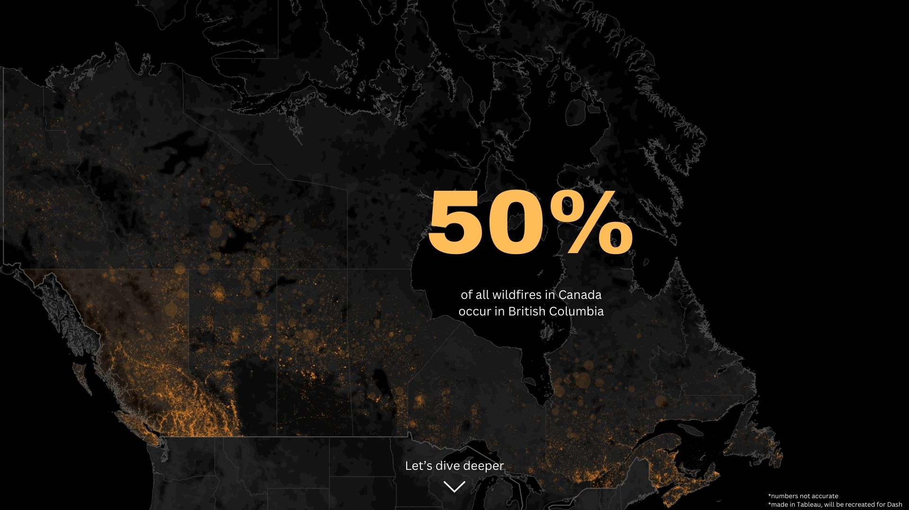
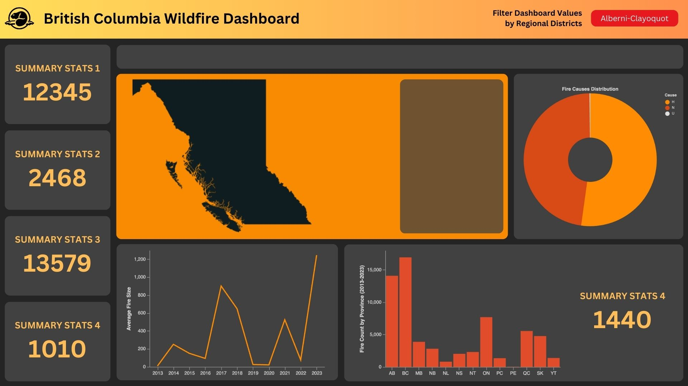

# DATA 551: Dataviz II - Project - README

**Name**: Amali Jayatileke, Kiran John, Kelsey Strachan, Jason Suwito

> **Our dashboard app can be found under the `reports` folder with the name `dashboard-app-main.py` and `dashboard-app-landing.py`**

This is a GitHub repository for the BC Wildfire Dashboard app. The app is an interactive data visualization tool designed to analyze and display wildfire occurrences across Canada, with a focus on British Columbia. The landing page of the app will be a full map of Canada, showing the fires between 2013 and 2023, emphasizing the quantity of fires which occurred in BC alone. We then transition to the main dashboard showcasing our primary analysis.The dashboard will contain data visualizations that shows the distribution (bar chart, histogram, contour plot, heatmap etc) of features in the data set (fire size, location, date (year, month, day), etc.).

### App Sketch:

