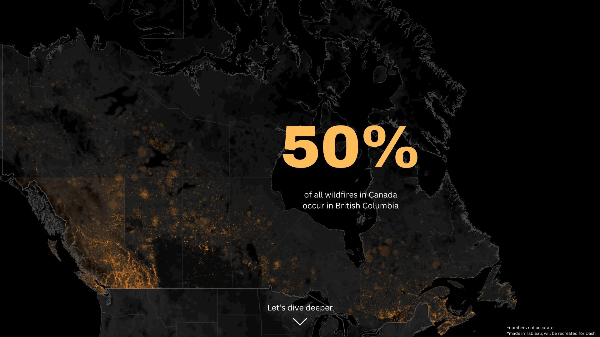
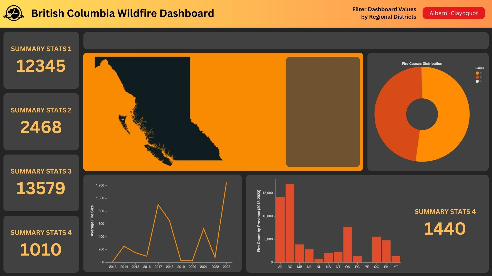

# DATA 551: Dataviz II - Project - README

**Name**: Amali Jayatileke, Kiran John, Kelsey Strachan, Jason Suwito

> **Our dashboard app can be found under the `src` folder with the name `dashboard-app.py`**

This GitHub repository contains the Canadian Wildfire Analysis dashboard app. This interactive data visualization tool is designed to analyze and display wildfire occurrences across Canada.

The app's landing page features a full map of Canada, displaying wildfires from 2013 to 2023, with an emphasis on the number of fires that occurred across the country. From there, users transition to the main dashboard, which showcases our primary analysis.

The dashboard includes various data visualizations, such as maps, bar charts, line charts, pie charts, and summary statistics cards. These visualizations illustrate key wildfire attributes, including fire size, location, cause, and date (year, month, and day).

Users can filter the entire dashboard based on province or year range. All elements in the dashboard dynamically update according to these global filters, ensuring an interactive and seamless data exploration experience.

### App Sketch:

